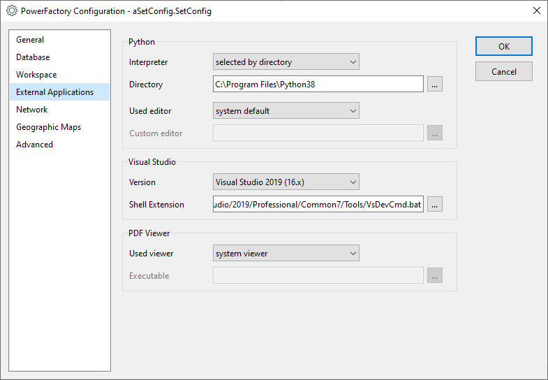
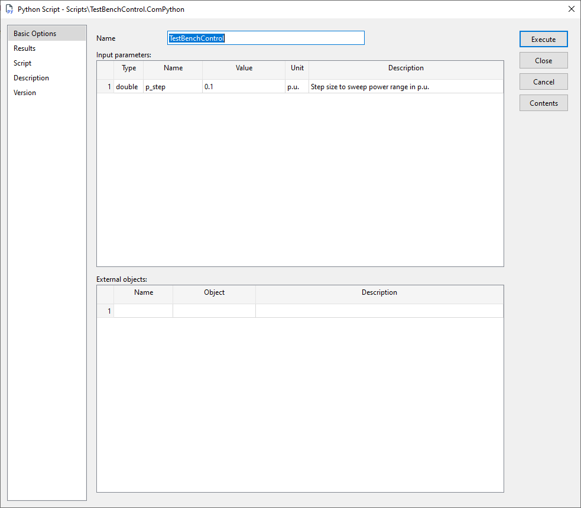

# Transformer Calculation Validation

As part of my Ph.D. thesis work I'd like to compare and validate transformer calculations
of [ie³'s](https://github.com/ie3-institute) internal behavior oriented and agent based simulation tool SIMONA against
the well known and recognized simulation tools [pandapower](https://github.com/e2nIEE/pandapower)
and [DIgSILENT PowerFactory](https://www.digsilent.de/en/powerfactory.html).

This repository aims in supplying scripts and models to obtain comparative calculations as well as means to evaluate the
results.

## Prerequisites to control DIgSILENT PowerFactory with provided scripts
### Select an appropriate Python interpreter
You may reach this setting via `Tools > Configuration...` and there in the section `External Applications`.
Unfortunately, to my knowledge, DIgSILENT PowerFactory to my knowledge does not support virtual environments (tested
with version 2021 SP 2).
Please point PowerFactory to a directory of your desired Python interpreter.
Note, that choosing a version here has some drawbacks (cf. next section).



### Have dependencies ready on your host machine.
As already stated, you are not able to select a virtual environment as Python interpreter.
Thus, you need to have all required dependencies ready within your host machine's Python installation.
As of now they are:
-   `numpy`

Moreover, due to search path's root being the executed script, you need to install this package to your local Python
installation. This is, because we use code that is shared among different simulator control scripts.
To install this script, invoke:

```shell
python -m pip install -e <path to this project>
```

**Attention:** Make sure to install this project into the correct Python interpreter!
Better choose a path to one of your installed environments to be sure (cf. figure above)!

If you afterwards want to get rid of this project, please invoke:
```shell
python -m pip uninstall tcv
```

### Configure the control script
You may find the control script object `TestBenchControl.ComPython` in the project's library at path `Scripts`.
Please make sure, that you have properly configured the object.

